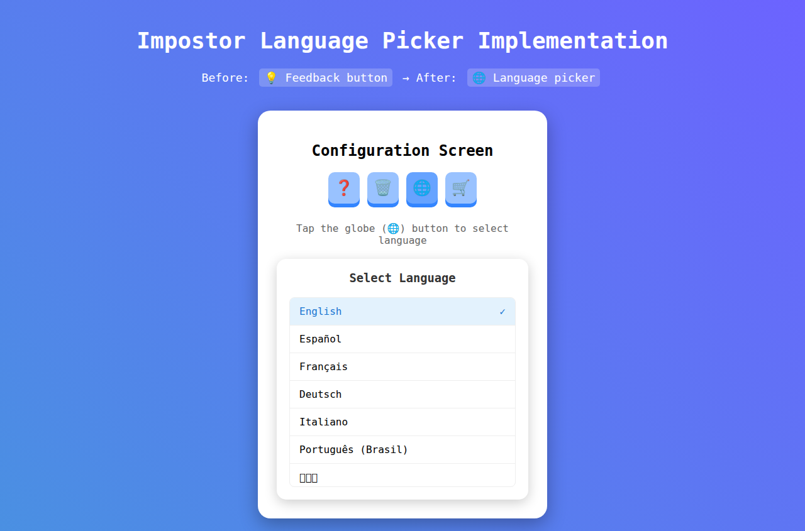
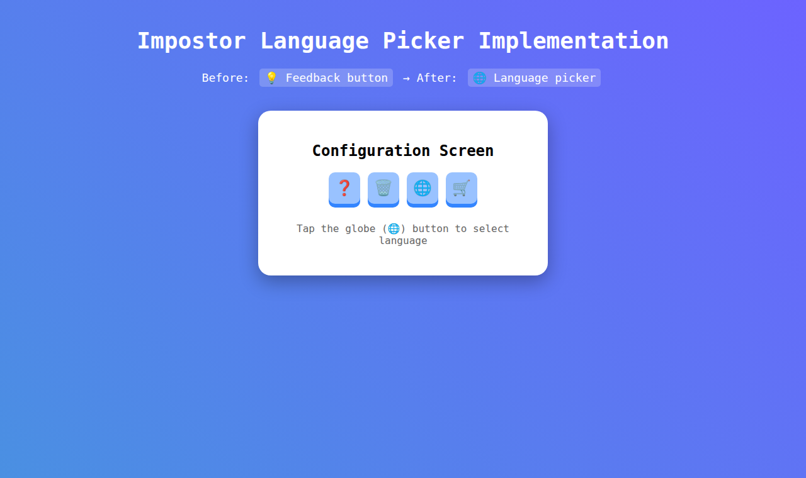

# Language Picker Implementation

## Overview
This implementation replaces the feedback functionality with a language picker that allows users to select from 40 available localizations.

## Files Changed

### 1. ConfigurationScene.swift
- **Removed**: Feedback button with "lightbulb" icon
- **Removed**: `doFeedback()` function that opened Twitter
- **Added**: `LanguagePickerButton()` component

### 2. New Files Created

#### LanguageManager.swift
- Manages language selection and persistence
- Automatically detects available languages from .lproj directories
- Implements fallback priority: chosen value → system preference #1 → system preference #2 → English
- Persists language selection in UserDefaults

#### LanguagePicker.swift
- SwiftUI component for language selection
- Shows list of all 40 available languages with user-friendly names
- Uses "globe" icon for the picker button
- Includes LanguagePickerButton wrapper component

#### LanguageManagerTests.swift
- Unit tests for LanguageManager functionality
- Tests language detection, selection, and display name generation

## Available Languages (40 total)
The app supports the following localizations:
- ar, ca, cs, da, de, el, en, en-AU, en-GB, en-IN
- es, es-419, fi, fr, fr-CA, he, hi, hr, hu, id
- it, ja, ko, ms, nb, nl, pl, pt-BR, pt-PT, ro
- ru, sk, sv, th, tr, uk, vi, zh-HK, zh-Hans, zh-Hant

## Implementation Details

### Language Selection Priority
1. **Chosen value**: User's explicit selection (persisted in UserDefaults)
2. **System preferred language #1**: First language in system preferences (if available)
3. **System preferred language #2**: Second language in system preferences (if available)
4. **English fallback**: Default to English if no system preferences match

### UI Changes
- Feedback button (lightbulb icon) → Language picker button (globe icon)
- Feedback functionality (Twitter integration) → Language selection sheet
- Maintains same button styling and audio feedback

### Technical Implementation
- Uses `@ObservableObject` for reactive UI updates
- Leverages Bundle.main.resourcePath to dynamically discover languages
- Applies `Locale.localizedString(forIdentifier:)` for user-friendly names
- Integrates with existing ImpostorButton styling system

## Screenshots

### Language Picker Interface

### Language Selection (Spanish Selected)

These screenshots demonstrate:
1. **Before**: The feedback button (💡 lightbulb icon) has been removed
2. **After**: The language picker button (🌐 globe icon) is now present
3. **Interaction**: Tapping the globe opens a sheet with all 40 available languages
4. **Selection**: Users can select any language with visual feedback (checkmark)
5. **UI Integration**: The picker maintains the existing ImpostorButton styling