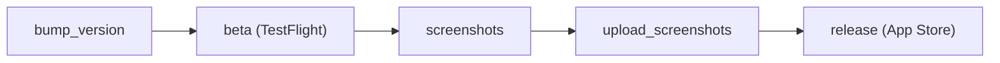

# Impostor

This is the Impostor iOS game.

Available on the App Store: <https://apps.apple.com/us/app/whos-the-impostor/id784258202?uo=4>

## Releasing a new version

The release process uses [fastlane](https://fastlane.tools).

### One-time setup

1. Install Ruby via rbenv (macOS system Ruby is too old for fastlane):

   ```sh
   brew install rbenv ruby-build
   rbenv init # follow the printed shell setup instructions, then restart your shell
   rbenv install   # installs the version from .ruby-version
   bundle install
   ```

2. Create `fastlane/api_key.json`:

   ```json
   {
     "key_id": "ABCD123456",
     "issuer_id": "00000000-0000-0000-0000-000000000000",
     "key_filepath": "/absolute/path/to/AuthKey_ABCD123456.p8"
   }
   ```

### Recommended release flow

The pipeline has five stages.



Execute the end-to-end flow with the combined command:

```sh
bundle exec fastlane ios full_release notes:"Bug fixes and performance improvements."
```

Or run individual stages:

```sh
bundle exec fastlane bump_version                                              # bump:patch (default), bump:minor, bump:major
bundle exec fastlane ios beta                                                  # builds and uploads to TestFlight
bundle exec fastlane ios screenshots                                           # capture screenshots
bundle exec fastlane ios screenshots locales:en-US devices:"iPhone 16 Pro"    # filter to one device
bundle exec fastlane ios upload_screenshots                                    # upload screenshots only
bundle exec fastlane ios release notes:"Bug fixes and performance improvements."
```

:information_source: `release` is submit-only. Run `screenshots` and `upload_screenshots` separately before `release` if screenshots changed.

:information_source: If a beta upload fails because the build number is behind App Store Connect, set the project build number once to remote highest + 1, commit, rerun, then continue local increments.

:information_source: To pin a specific build number, add `build_number:123` to any `beta` or `release` command.
